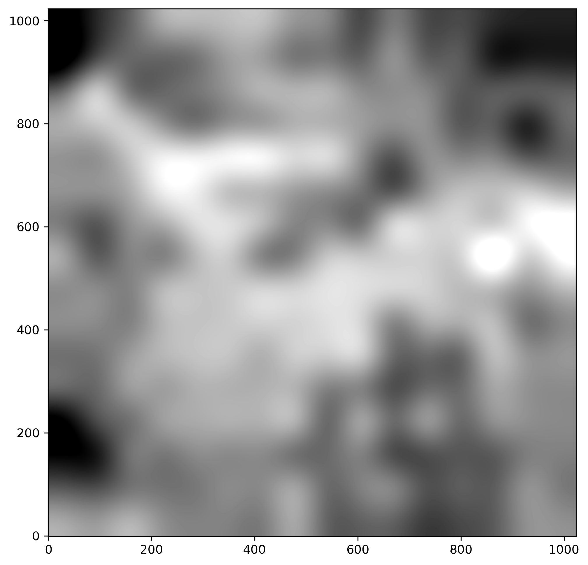
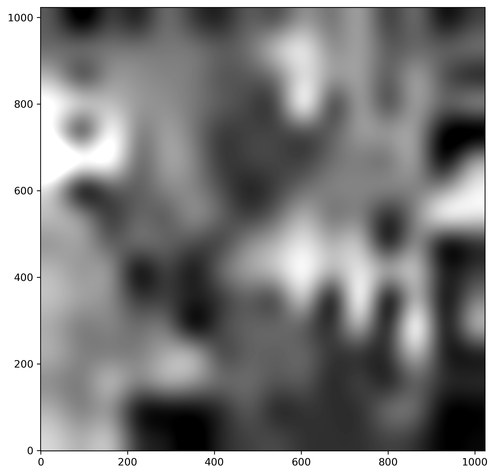

# Welcome to the STAREXTRACTOR package

[](https://pypi.python.org/pypi/starextractor/) [](https://pypi.python.org/pypi/starextractor/) [](https://pypi.python.org/pypi/starextractor/) [](https://GitHub.com/lcx366/STAREXTRACTOR/graphs/contributors/) [](https://GitHub.com/lcx366/STAREXTRACTOR/graphs/commit-activity) [](https://github.com/lcx366/STAREXTRACTOR/blob/master/LICENSE) [](http://starextractor.readthedocs.io/?badge=latest) [](https://travis-ci.org/lcx366/starextractor)

This package is an archive of scientific routines for astronomical image processing related to the source extraction and photometry.
Currently, operations on source extraction include:

1. Read and parse an astronomical image in follwing formats: `.fits`, generic image format like `.bmp`,  NumPy-specific binary files like `.npy` and 2D array;
2. Estimate the Full width at half maximum (FWHM) of the gaussian kernel for the image.
3. Extract the centroid coordinates of the star spots using the DAOFIND algorithm  implementation from [`photutils`]([Photutils &#8212; photutils 1.9.0](https://photutils.readthedocs.io/en/stable/index.html#));
4. Visualize the grayscale image of original/background/background-subtracted/background noise levels;

Operations on photometry include:

1. **Aperture Photometry**. It is widely used in general star field photometry, but less suitble for crowded star fields with light spots overlapped and when stars are located on the image boundaries.

2. **Point Spread Function(PSF)/Pixel Response Function(PRF) Photometry**. It solved the problem encountered by the aperture photometry, and can estimate the brightness of stars more accurately.

3. **DAOPHOT Photometry**. It is essentially iterative PSF photometry, useful for crowded fields where faint stars are very close to bright stars. The faint stars may not be detected until after the bright stars are subtracted, so it can find more faint stars by a number of iterations.

4. Show original image with star spots marked;

## How to Install

On Linux, macOS and Windows architectures, the binary wheels can be installed using `pip` by executing one of the following commands:

```
pip install starextractor
pip install starextractor --upgrade # to upgrade a pre-existing installation
```

## How to use

### Read an astronomical image

Currently, supported image formats include `.fits`, generic image format(such as `.bmp`), NumPy-specific binary files like`.npy`, and 2D numpy array.

```python
>>> from starextractor import parse_image
>>> imagefile = 'obs/fits/img_00000.fits' 
>>> #imagefile = 'obs/bmp/img_00000.bmp'
>>> #imagefile = 'obs/npy/img_00000.npy'
>>> data = parse_image(imagefile)
>>> # data = parse_image(image_array)
>>> print(data)
```

Estimate the Full width at half maximum (FWHM) of the gaussian kernel for the image data.

```python
>>> print(data.fwhm) # in pixels
>>> # 9.439381701950126
>>> print(data.sigma) # Sigma of the gaussian kernel
```

The relationship between the sigma and FWHM is expressed as

$$
FWHM = 2\sqrt{2\ln2}\sigma ≈ 2.355 \sigma
$$

Now, output the attributes associated to the image data.

```python
>>> print(data.image_raw) # Original grayscale image
>>> print(data.bkg) # Grayscale background
>>> print(data.image) # Image of background subtracted
>>> print(data.bkg_rms) # Background noise levels
```

### Show grayscale image

```python
>>> data.show('image_raw') # original image
>>> # data.show('image_raw','figs/raw_image.png') # save to a figure
>>> data.show('image') # background-subtracted
>>> data.show('bkg') # background
>>> data.show('bkg_rms') # background noise levels
```

<p align="middle">
  
  
</p>

<p align="middle">
  
  
</p>

### Extract centroid coordinates of star spots and do photometry

Using the DAOFIND algorithm to extract centroid coordinates and do photometry with Aperture Photometry method.

```python
>>> sources = data.find_source(phot='aperture',edgemask=True)
>>> print(sources)
>>> # <Source object: NUM = 25 OFFSET = [511.5 511.5] EDGEMASK = True PHOT = 'APERTURE'>
>>> # Output the centroid coordinates, brightness(sum of gray value within an aperture), and SNR of star spots.
>>> print(sources.xy,sources.brightness,sources.snr)
```

Use the previously estimated centroid coordinates by DAOFIND algorithm as the prior value, fit the centroid coordinates and  do photometry with the PSF Photometry method.

```python
>>> sources = data.find_source(phot='psf',edgemask=True)
>>> print(sources)
>>> # <Source object: NUM = 25 OFFSET = [511.5 511.5] EDGEMASK = True PHOT = 'PSF'>
```

Use the previously estimated centroid coordinates by DAOFIND algorithm as the prior value, fit the centroid coordinates and do photometry with the DAOPHOT Photometry method.

```python
>>> sources = data.find_source(phot='dao',edgemask=True)
>>> print(sources)
>>> # <Source object: NUM = 26 OFFSET = [511.5 511.5] EDGEMASK = True PHOT = 'DAO'>
```

### Show the extracted sources in image

```python
>>> sources.show()
>>> #sources.show('figs/sources.png') # save image to a file
```

<p align="middle">
  
</p>

## Change log

- **0.2.0 — Nov 06, 2023**
  
  - Added implementation for automatically estimate the Full width at half maximum (FWHM) of the gaussian kernel for the image.
  
  - Added implementation for Point Spread Function(PSF)/Pixel Response Function(PRF) Photometry
  
  - Added implementation for DAOPHOT Photometry

- **0.1.8 — Oct 22, 2023**
  
  - Added an information-rich string representation of the object and fixed some annotation typos.

- **0.1.7 — Sep 23, 2023**
  
  - Fixed a warning caused by determining whether an array is empty in Python of version > 3.9.

- **0.1.6 — Jun 29,  2023**
  
  - Added support for image file formats `.npy` and `numpy array` in function *AstroImage.read_image()*

- **0.1.5 — May 14,  2023**
  
  - The class `Centriod` is *deprecated*, and the class `Source` is used instead
  - Add method `.invariantfeatures()` to class `Source`, which calculates the triangle invariants and constructs a 2D Tree; and records the asterism indices for each triangle.

- **0.1.0 — Apr 5,  2023**
  
  - The ***starextractor*** package was released.

## Reference

- [photutils](https://photutils.readthedocs.io/en/stable/index.html)
- [Photometry Methods](http://srmastro.uvacreate.virginia.edu/astr313/lectures/photometry/photometry_methods.html)
- [Astroalign](https://astroalign.quatrope.org/en/latest/)